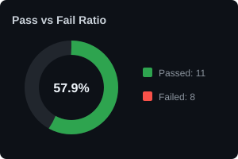
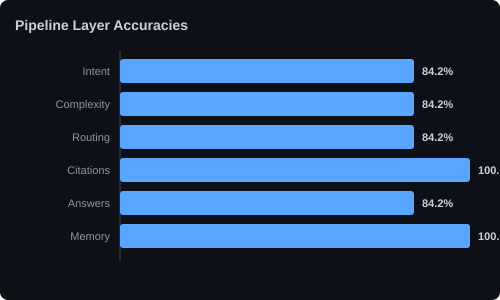

# RAG Pipeline Evaluation Report

## Executive Summary

| Metrics | Value |
|---|---|
| **Total Test Cases** | 19 |
| **Passed Cases** | 11 |
| **Failed Cases** | 8 |
| **Overall Score** | 89.5% |
| **Average Latency** | 90125 ms |
| **Average Confidence** | 92.5% |
| **Average Compression Ratio** | 45.5% |

---

## Visualizations

### Pass / Fail Ratio

### Pipeline Accuracies

---

## Layer Metrics Detail

- **Intent Accuracy**: 84.2%
- **Complexity Accuracy**: 84.2%
- **Routing Accuracy**: 84.2%
- **Citation Accuracy**: 100.0%
- **Answer Accuracy**: 84.2%
- **Memory Accuracy**: 100.0%

---

## Failed Cases List (8)

### [1] Query: "What is the medical insurance amount?"
- **Expected Intent**: FACT_LOOKUP | **Got**: FACT_LOOKUP
- **Expected Complexity**: SIMPLE | **Got**: SIMPLE
- **Routed Docs**: Expected: ['Insurance.pdf'] | Actual: ['Insurance.pdf']
- **Failure Reason**: `Keyword missing in answer. Expected keyword: 'medical insurance'`
- **Suggested Fix**: Verify retrieved document chunks contain the target answers.

### [2] Query: "What is the travel reimbursement limit?"
- **Expected Intent**: FACT_LOOKUP | **Got**: FACT_LOOKUP
- **Expected Complexity**: SIMPLE | **Got**: SIMPLE
- **Routed Docs**: Expected: ['Finance_Policy.pdf'] | Actual: ['Finance_Policy.pdf', 'HR_Policy.pdf', 'Insurance.pdf']
- **Failure Reason**: `Keyword missing in answer. Expected keyword: 'travel'`
- **Suggested Fix**: Verify retrieved document chunks contain the target answers.

### [3] Query: "List all employee benefits."
- **Expected Intent**: LIST | **Got**: LIST
- **Expected Complexity**: COMPLEX | **Got**: COMPLEX
- **Routed Docs**: Expected: ['HR_Policy.pdf', 'Insurance.pdf'] | Actual: ['HR_Policy.pdf', 'Insurance.pdf']
- **Failure Reason**: `Latency (1522121ms) exceeded threshold (35000ms).`
- **Suggested Fix**: Retrieve or generation calls took too long. Check Groq rate limits or cache models locally.

### [4] Query: "List all leave types."
- **Expected Intent**: LIST | **Got**: LIST
- **Expected Complexity**: COMPLEX | **Got**: COMPLEX
- **Routed Docs**: Expected: ['HR_Policy.pdf'] | Actual: ['HR_Policy.pdf']
- **Failure Reason**: `Keyword missing in answer. Expected keyword: '18'`
- **Suggested Fix**: Verify retrieved document chunks contain the target answers.

### [5] Query: "Does it include dental?"
- **Expected Intent**: YES_NO | **Got**: COMPARISON
- **Expected Complexity**: SIMPLE | **Got**: SIMPLE
- **Routed Docs**: Expected: ['Insurance.pdf'] | Actual: ['Insurance.pdf']
- **Failure Reason**: `Latency (11658ms) exceeded threshold (10000ms).`
- **Suggested Fix**: Retrieve or generation calls took too long. Check Groq rate limits or cache models locally.

### [6] Query: "Can my family be covered?"
- **Expected Intent**: YES_NO | **Got**: YES_NO
- **Expected Complexity**: SIMPLE | **Got**: SIMPLE
- **Routed Docs**: Expected: ['Insurance.pdf'] | Actual: ['Insurance.pdf']
- **Failure Reason**: `Latency (15316ms) exceeded threshold (10000ms).`
- **Suggested Fix**: Retrieve or generation calls took too long. Check Groq rate limits or cache models locally.

### [7] Query: "What is the medical insurance amount?"
- **Expected Intent**: FACT_LOOKUP | **Got**: FACT_LOOKUP
- **Expected Complexity**: SIMPLE | **Got**: SIMPLE
- **Routed Docs**: Expected: ['Insurance.pdf'] | Actual: ['Insurance.pdf']
- **Failure Reason**: `Latency (13111ms) exceeded threshold (10000ms).`
- **Suggested Fix**: Retrieve or generation calls took too long. Check Groq rate limits or cache models locally.

### [8] Query: "What is the leave policy?"
- **Expected Intent**: FACT_LOOKUP | **Got**: FACT_LOOKUP
- **Expected Complexity**: SIMPLE | **Got**: MEDIUM
- **Routed Docs**: Expected: ['HR_Policy.pdf'] | Actual: ['HR_Policy.pdf']
- **Failure Reason**: `Latency (37955ms) exceeded threshold (10000ms).`
- **Suggested Fix**: Retrieve or generation calls took too long. Check Groq rate limits or cache models locally.

